# 📊 Schémas Mermaid pour le Rapport

Ce fichier contient tous les schémas Mermaid prêts à être copiés dans votre rapport.

> **Note**: Ces schémas sont au format Mermaid et peuvent être rendus dans GitHub, GitLab, ou tout éditeur Markdown supportant Mermaid.

---

## 1. Architecture Globale du Projet

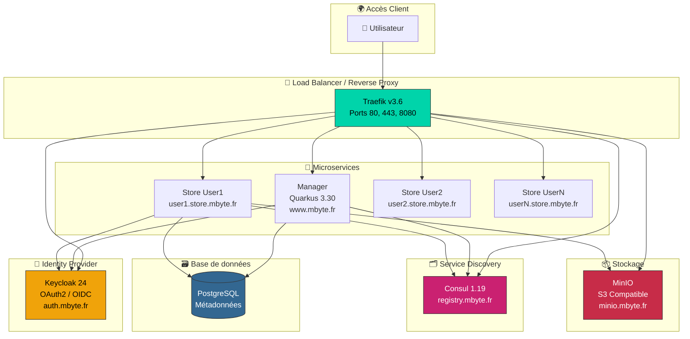

---

## 2. Architecture Ancienne (Stockage Local)

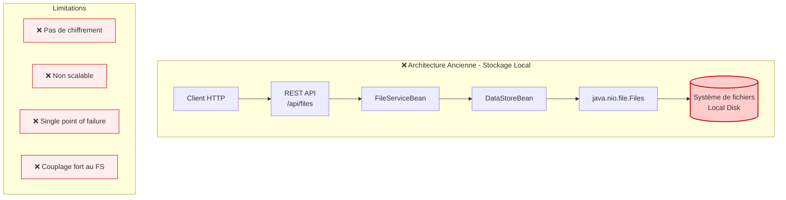

---

## 3. Architecture Nouvelle (Multi-Backend S3)

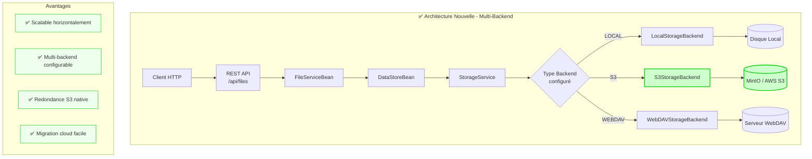

---

## 4. Diagramme de Classes - Storage Backend

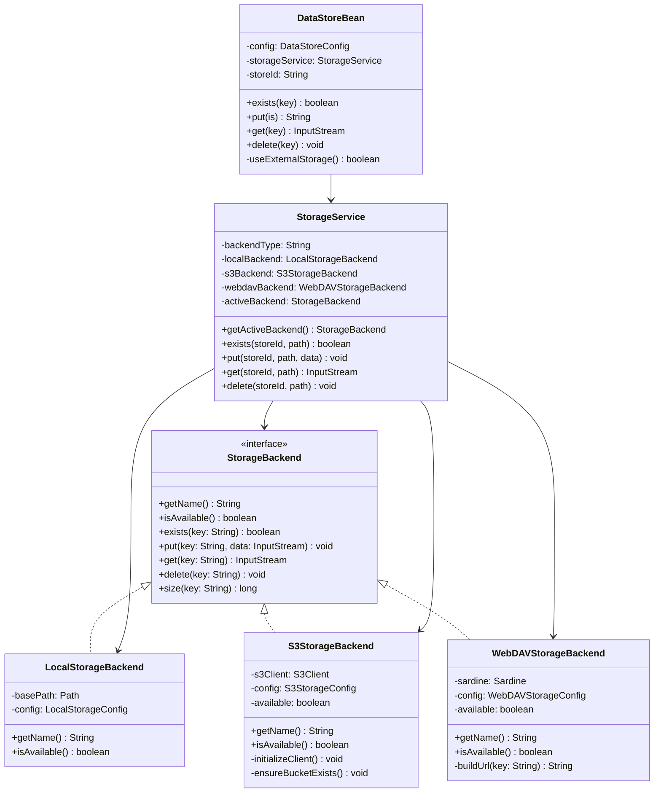

---

## 5. Flow d'Authentification OAuth2/OIDC

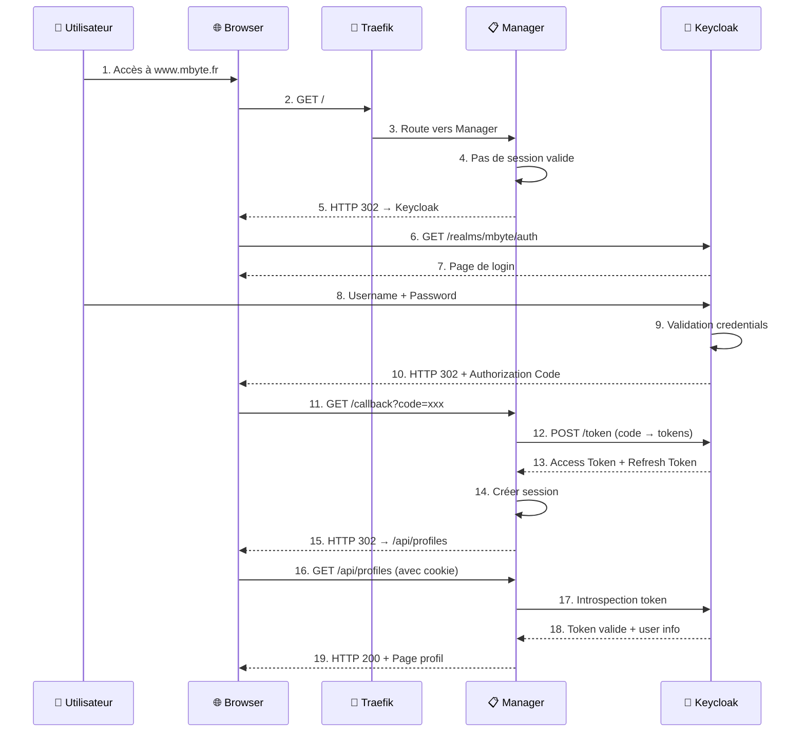

---

## 6. Flow d'Upload de Fichier vers MinIO

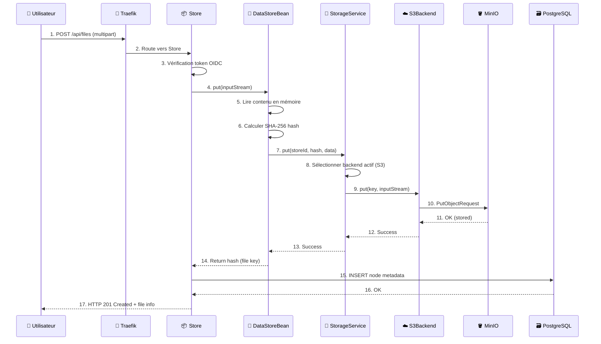

---

## 7. Infrastructure Docker Compose

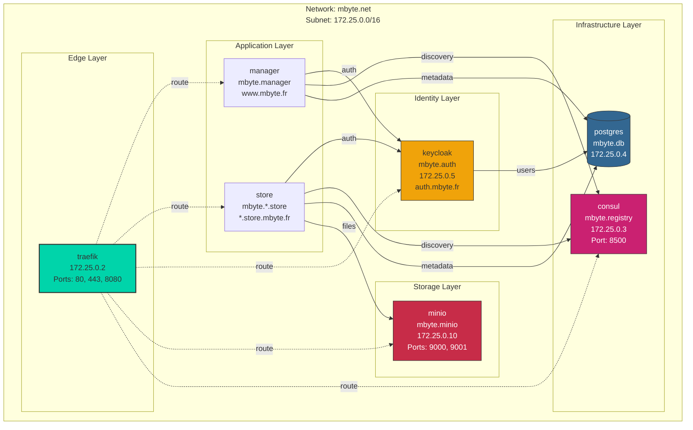

---

## 8. Service Discovery avec Consul

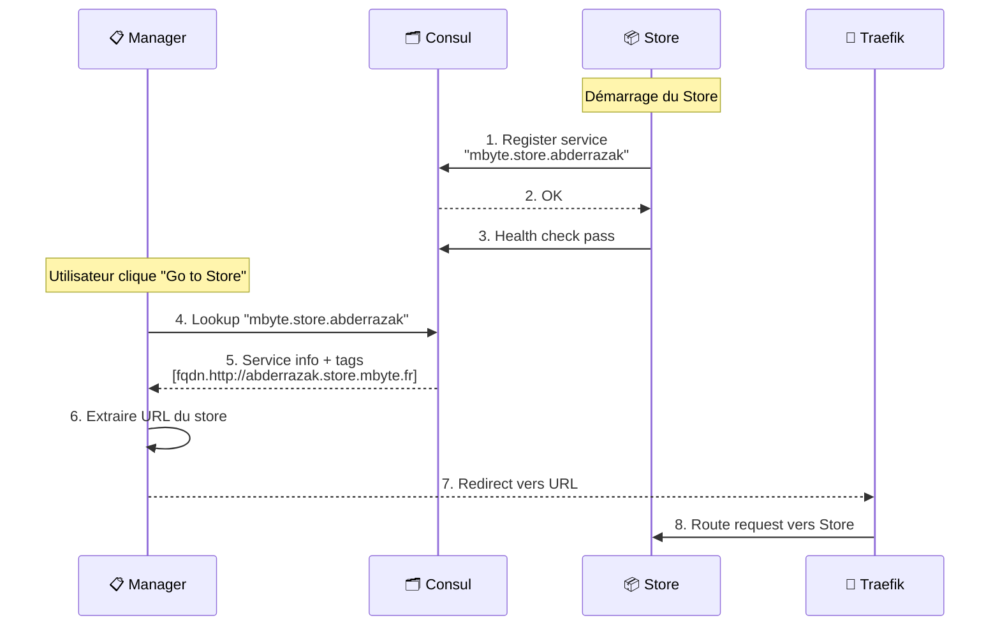

---

## 9. Cycle de vie d'un Store

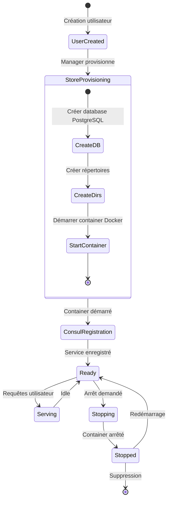

---

## 10. Sélection du Backend de Stockage

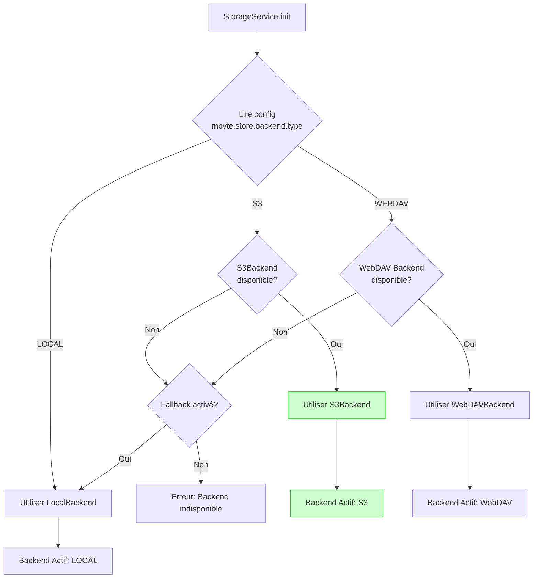

---

## 11. Comparaison des Technologies

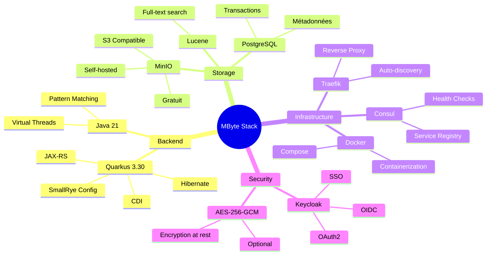

---

## 12. Endpoints et Routage

```mermaid
flowchart LR
    subgraph "DNS / Hosts"
        D1[www.mbyte.fr]
        D2[auth.mbyte.fr]
        D3[*.store.mbyte.fr]
        D4[registry.mbyte.fr]
        D5[minio.mbyte.fr]
    end
    
    subgraph "Traefik Routers"
        R1[manager@docker]
        R2[keycloak@docker]
        R3[store-*@docker]
        R4[consul@docker]
        R5[minio@docker]
    end
    
    subgraph "Services"
        S1[Manager:8080]
        S2[Keycloak:80]
        S3[Store:8080]
        S4[Consul:8500]
        S5[MinIO:9000]
    end
    
    D1 --> R1 --> S1
    D2 --> R2 --> S2
    D3 --> R3 --> S3
    D4 --> R4 --> S4
    D5 --> R5 --> S5
```

---

## 📋 Comment utiliser ces schémas

### Dans GitHub/GitLab

Les schémas Mermaid sont rendus automatiquement dans les fichiers Markdown.

### Dans un rapport Word/PDF

1. Copiez le code Mermaid
2. Utilisez [Mermaid Live Editor](https://mermaid.live)
3. Exportez en PNG ou SVG
4. Insérez l'image dans votre rapport

### Dans une présentation

Exportez les schémas en images haute résolution depuis Mermaid Live Editor.

---

*Dernière mise à jour : 14 janvier 2026*
