# 🎓 MByte - Documentation de Présentation

> **Projet de TP - Janvier 2026**  
> Réalisé par : SEGHIR & BEKKOUCHE

---

## 📋 Table des matières

1. [Vue d'ensemble du projet](#vue-densemble-du-projet)
2. [Architecture globale](#architecture-globale)
3. [Technologies utilisées](#technologies-utilisées)
4. [Flow d'authentification](#flow-dauthentification)
5. [Flow de stockage de fichiers](#flow-de-stockage-de-fichiers)
6. [Infrastructure Docker](#infrastructure-docker)
7. [Issue #20 - Intégration stockage externe](#issue-20---intégration-stockage-externe)
8. [Choix technologiques](#choix-technologiques)
9. [Schémas détaillés](#schémas-détaillés)

---

## 🌐 Vue d'ensemble du projet

MByte est une plateforme de stockage de fichiers distribuée permettant à chaque utilisateur de disposer de son propre **store** (espace de stockage). L'architecture est basée sur des microservices avec :

- **Manager** : Gestion des profils utilisateurs et orchestration des stores
- **Store** : Service de stockage de fichiers par utilisateur
- **Auth (Keycloak)** : Authentification et autorisation OAuth2/OIDC
- **Consul** : Service Discovery et configuration
- **Traefik** : Reverse proxy et routage dynamique
- **MinIO** : Stockage objet compatible S3

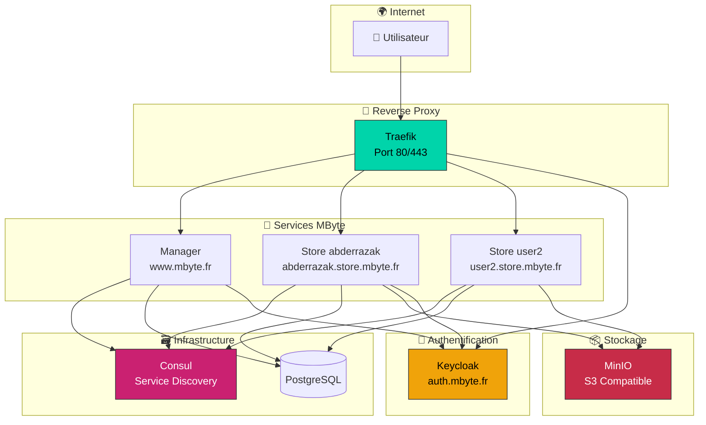

---

## 🏗️ Architecture globale

### Architecture 3-tiers avec microservices

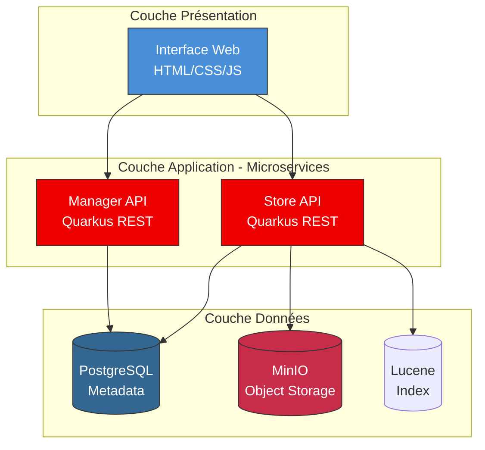

### Communication entre services

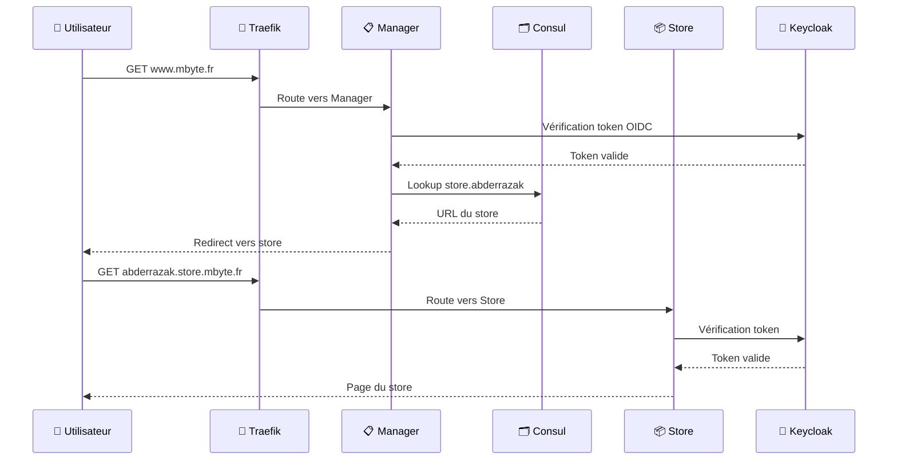

---

## 🛠️ Technologies utilisées

### Backend

| Technologie | Version | Rôle |
|-------------|---------|------|
| **Quarkus** | 3.30.1 | Framework Java cloud-native |
| **Java** | 21 (LTS) | Langage de programmation |
| **JAX-RS (RESTEasy)** | - | API REST |
| **Hibernate ORM** | - | Mapping objet-relationnel |
| **Liquibase** | - | Migration de base de données |
| **Apache Tika** | - | Détection de types MIME |
| **Apache Lucene** | - | Indexation full-text |

### Stockage

| Technologie | Rôle |
|-------------|------|
| **PostgreSQL** | Base de données relationnelle (métadonnées) |
| **MinIO** | Stockage objet compatible S3 |
| **AWS SDK 2.25** | Client S3 pour MinIO/AWS |
| **Sardine** | Client WebDAV |

### Infrastructure

| Technologie | Version | Rôle |
|-------------|---------|------|
| **Docker** | 29.x | Conteneurisation |
| **Traefik** | 3.6 | Reverse proxy / Load balancer |
| **Consul** | 1.19 | Service discovery & Config |
| **Keycloak** | 24.x | Identity & Access Management |

### Sécurité

| Technologie | Rôle |
|-------------|------|
| **OAuth2 / OIDC** | Protocole d'authentification |
| **Keycloak** | Serveur d'identité |
| **AES-256-GCM** | Chiffrement des données (optionnel) |

---

## 🔐 Flow d'authentification

### OAuth2 / OpenID Connect avec Keycloak

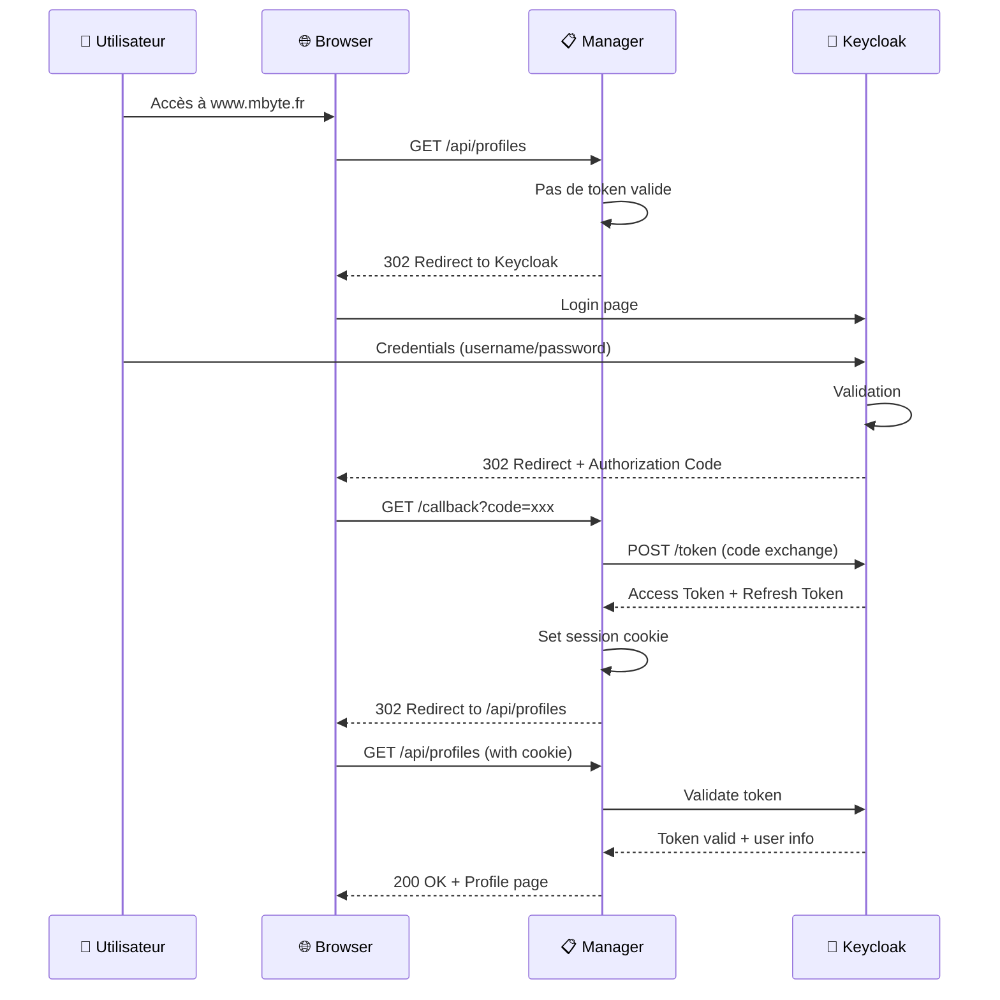

### Configuration OIDC dans Quarkus

```properties
# application.properties
quarkus.oidc.auth-server-url=http://auth.mbyte.fr/realms/mbyte
quarkus.oidc.client-id=mbyte
quarkus.oidc.application-type=hybrid
quarkus.oidc.token.principal-claim=preferred_username
quarkus.oidc.roles.source=accesstoken
```

---

## 📁 Flow de stockage de fichiers

### Upload de fichier avec MinIO

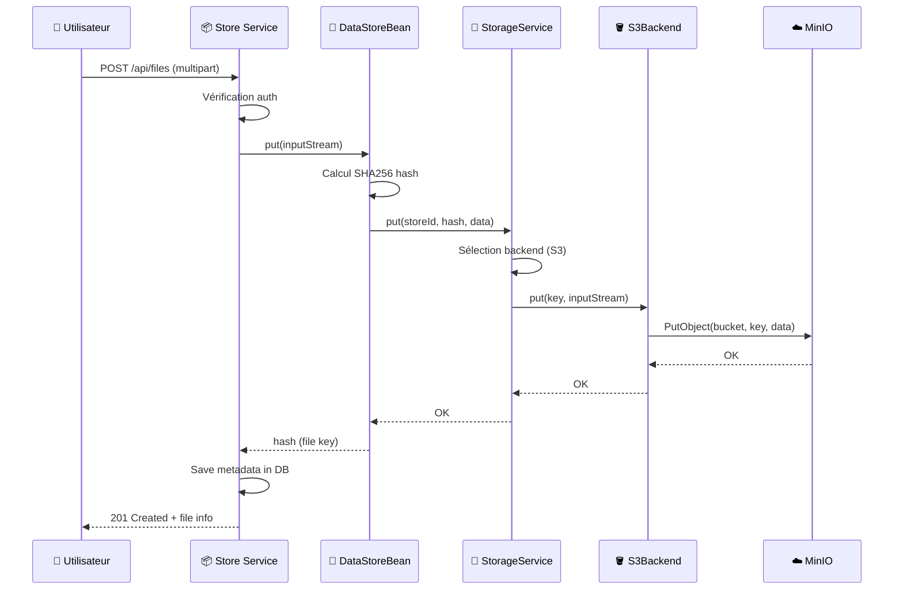

### Architecture du stockage (Issue #20)

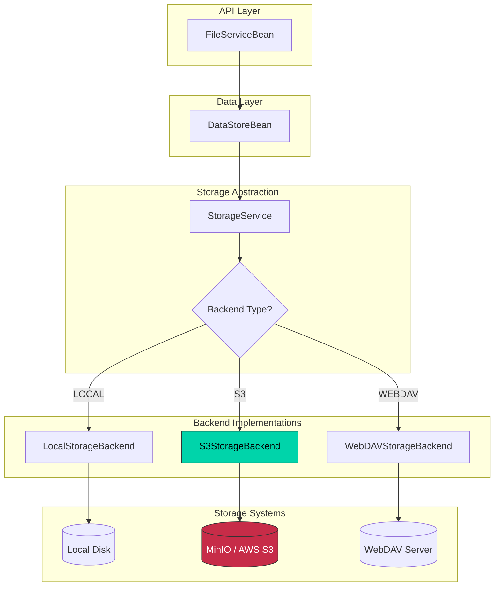

---

## 🐳 Infrastructure Docker

### Docker Compose - Services

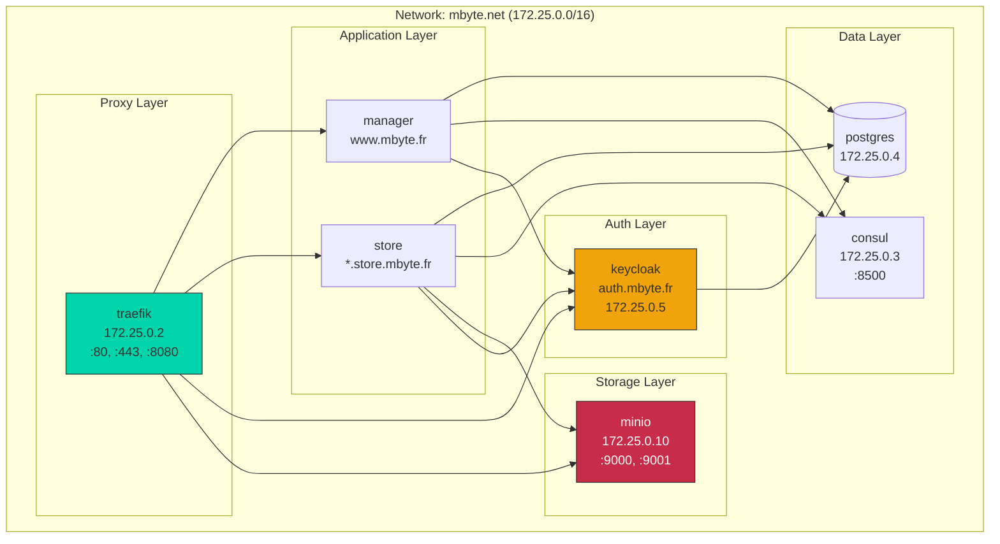

### Labels Traefik pour le routage

```yaml
# Exemple pour le store
labels:
  - "traefik.enable=true"
  - "traefik.http.routers.store-abderrazak.rule=Host(`abderrazak.store.mbyte.fr`)"
  - "traefik.http.routers.store-abderrazak.entrypoints=http"
  - "traefik.http.services.store-abderrazak.loadbalancer.server.port=8080"
```

---

## 🔌 Issue #20 - Intégration stockage externe

### Objectif

Permettre le stockage des fichiers sur des backends externes (S3, WebDAV) au lieu du système de fichiers local.

### Avant (Architecture locale)

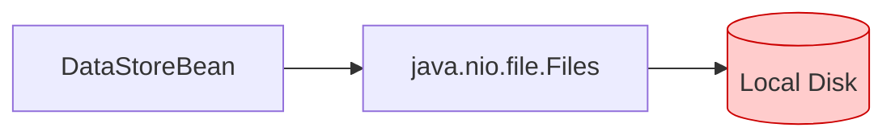

**Limitations :**
- ❌ Non scalable
- ❌ Single point of failure
- ❌ Pas de redondance
- ❌ Difficile à distribuer

### Après (Architecture multi-backend)

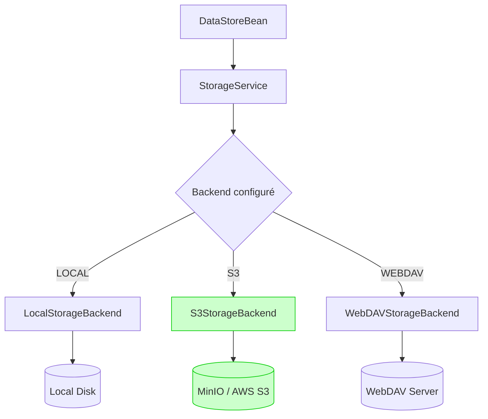

**Avantages :**
- ✅ Scalabilité horizontale
- ✅ Redondance native (S3)
- ✅ Choix du backend par configuration
- ✅ Migration facile vers le cloud

### Interface StorageBackend

```java
public interface StorageBackend {
    String getName();
    boolean isAvailable();
    boolean exists(String key);
    void put(String key, InputStream data) throws StorageBackendException;
    InputStream get(String key) throws StorageBackendException;
    void delete(String key) throws StorageBackendException;
    long size(String key) throws StorageBackendException;
}
```

### Configuration

```properties
# Type de backend: LOCAL, S3, WEBDAV
mbyte.store.backend.type=S3

# Configuration S3/MinIO
mbyte.store.backend.s3.enabled=true
mbyte.store.backend.s3.endpoint=http://minio:9000
mbyte.store.backend.s3.access-key=minioadmin
mbyte.store.backend.s3.secret-key=minioadmin
mbyte.store.backend.s3.bucket=mbyte-stores
mbyte.store.backend.s3.region=us-east-1
mbyte.store.backend.s3.path-style-access=true
```

---

## 💡 Choix technologiques

### Pourquoi Quarkus ?

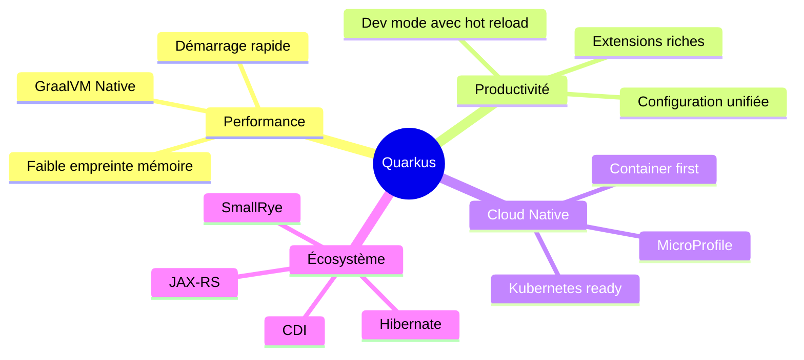

| Critère | Quarkus | Spring Boot |
|---------|---------|-------------|
| Temps de démarrage | ~0.5s | ~3-5s |
| Mémoire (RSS) | ~50MB | ~200MB |
| Native compilation | ✅ GraalVM | ⚠️ Expérimental |
| Dev experience | ✅ Hot reload | ✅ DevTools |

### Pourquoi MinIO ?

| Critère | MinIO | AWS S3 |
|---------|-------|--------|
| Coût | Gratuit (self-hosted) | Pay per use |
| API | 100% compatible S3 | Native |
| Déploiement | Docker simple | Cloud only |
| Latence | Locale (rapide) | Réseau |
| Dev/Test | ✅ Idéal | Coûteux |

**Stratégie :** Développer avec MinIO, migrer vers AWS S3 en production sans changer le code.

### Pourquoi Keycloak ?

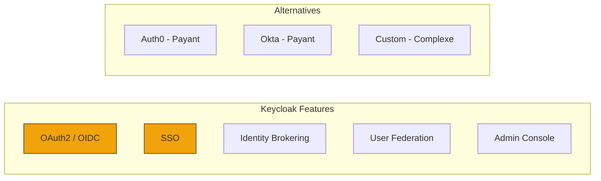

- ✅ Open source et gratuit
- ✅ Standards OAuth2/OIDC
- ✅ Console d'administration
- ✅ Intégration Quarkus native

### Pourquoi Consul ?

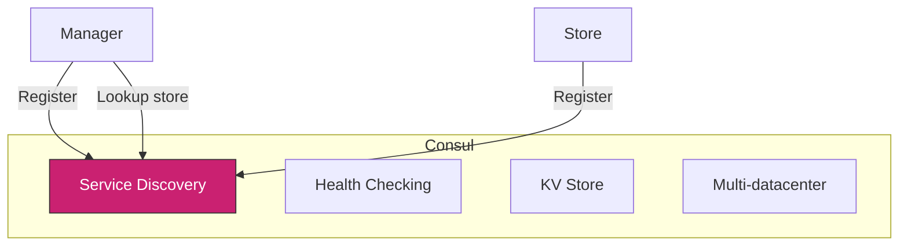

- ✅ Service discovery dynamique
- ✅ Health checks automatiques
- ✅ Configuration centralisée
- ✅ Scalabilité multi-DC

### Pourquoi Traefik ?

| Feature | Traefik | Nginx |
|---------|---------|-------|
| Config dynamique | ✅ Auto (Docker labels) | ❌ Reload manuel |
| Let's Encrypt | ✅ Automatique | ⚠️ Certbot |
| Dashboard | ✅ Intégré | ❌ Externe |
| Load balancing | ✅ Natif | ✅ Natif |

---

## 📊 Schémas détaillés

### Cycle de vie d'un store

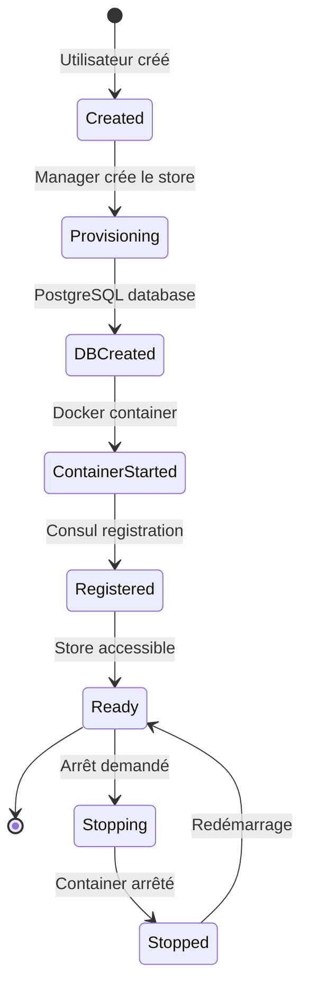

### Flux de données complet

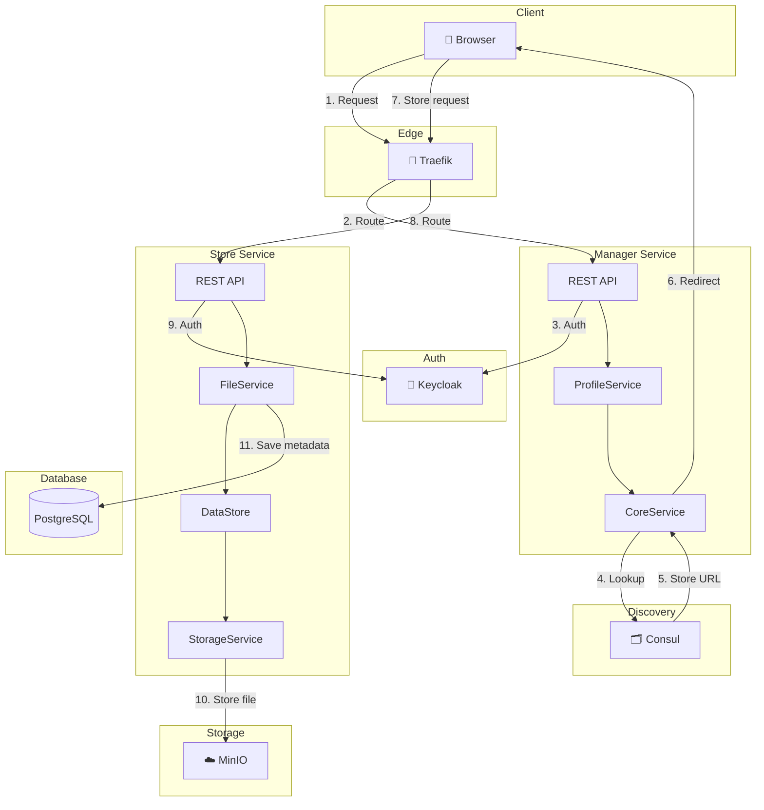

---

## 📝 Résumé

### Points clés de l'architecture

1. **Microservices** : Manager et Store sont des services indépendants
2. **Service Discovery** : Consul permet la découverte dynamique des stores
3. **Authentification centralisée** : Keycloak gère tous les accès
4. **Stockage flexible** : Support LOCAL, S3 (MinIO), WebDAV
5. **Routage dynamique** : Traefik route automatiquement vers les services

### Ce qui a été implémenté (Issue #20)

- [x] Interface `StorageBackend` abstraite
- [x] Implémentation `LocalStorageBackend`
- [x] Implémentation `S3StorageBackend` (MinIO compatible)
- [x] Implémentation `WebDAVStorageBackend`
- [x] Service `StorageService` avec sélection automatique
- [x] Intégration avec `DataStoreBean` existant
- [x] Configuration via `application.properties`
- [x] Service MinIO dans docker-compose

### URLs du projet

| Service | URL |
|---------|-----|
| Manager | http://www.mbyte.fr |
| Store (abderrazak) | http://abderrazak.store.mbyte.fr |
| Keycloak | http://auth.mbyte.fr |
| Consul | http://registry.mbyte.fr |
| MinIO Console | http://localhost:9001 |
| Traefik Dashboard | http://localhost:8080 |

---

*Documentation générée le 14 janvier 2026*
